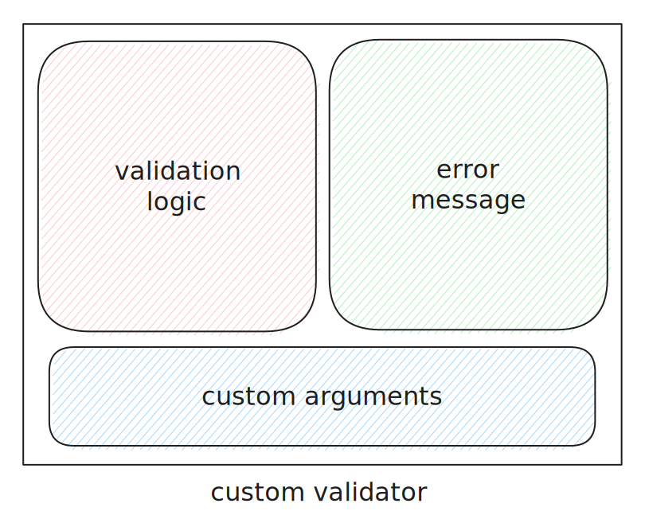
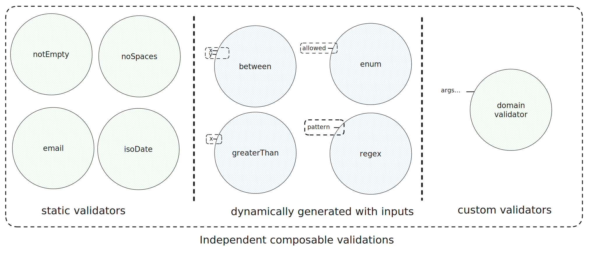
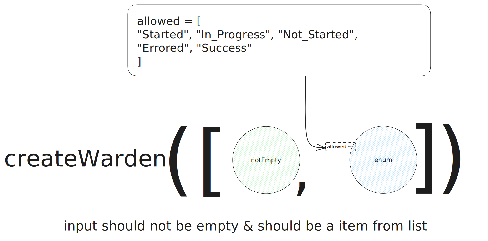
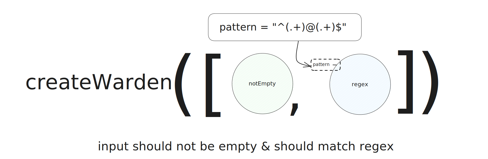

# form_warden

A very simple package to help you write robust, reusable and extendable validations to go with your [Flutter Forms](https://flutter.dev/docs/cookbook/forms/validation).

[](https://github.com/sarkarshuvojit/form_warden/tree/main/example)

## How it works

### Building Blocks

Create simple or complex blocks of validation, and compose those building blocks to create flutter validators.
Each block will have it's own logic, a set of args to create dynamic validators & specific error messages for each block.



There are simple ones, configurable ones and even you can create validations aligned to the domain of the app.



### Creating a warden

A warden will be a collection of validation blocks. Examples of enum & email pattern checking is added below.






## Installation

To use this package, add `form_warden` as a [dependency in your pubspec.yaml](https://flutter.dev/docs/development/packages-and-plugins/using-packages) file.

## Usage

#### Import the package
```dart
import 'package:form_warden/form_warden.dart';
```

#### Required field (inbuilt-validator)

```dart
TextFormField(
    autovalidateMode: AutovalidateMode.onUserInteraction,
    validator: createWarden([Validators.required]),
    decoration: InputDecoration(
        border: OutlineInputBorder(),
        labelText: f.label,
    ),
    onSaved: null,
),

```

#### Required email field (using inbuilt validator)

```dart
TextFormField(
    autovalidateMode: AutovalidateMode.onUserInteraction,
    validator: createWarden([Validators.required, Validators.email]),
    decoration: InputDecoration(
        border: OutlineInputBorder(),
        labelText: f.label,
    ),
    onSaved: null,
),
```

#### Custom validator

```dart
ValidatorFunction greaterThanTen = (value) {
    if (value is int && value > 10) {
        return null;
    }
    return "Must be greater than 10";
};
```

```dart
TextFormField(
    autovalidateMode: AutovalidateMode.onUserInteraction,
    validator: createWarden([greaterThanTen]),
    decoration: InputDecoration(
        border: OutlineInputBorder(),
        labelText: f.label,
    ),
    onSaved: null,
)
```

#### Club multiple validators together to create robust validators

```dart
ValidatorFunction greaterThanTen = (value) {
    if (value is int && value > 10) {
        return null;
    }
    return "Must be greater than 10";
};
ValidatorFunction lessThanHundred = (value) {
    if (value is int && value < 100) {
        return null;
    }
    return "Must be less than 100";
};
```

```dart

TextFormField(
    autovalidateMode: AutovalidateMode.onUserInteraction,
    validator: createWarden([greaterThanTen, lessThanHundred]),
    decoration: InputDecoration(
        border: OutlineInputBorder(),
        labelText: f.label,
    ),
    onSaved: null,
)
```

#### Using higher order functions create configurable validators

```dart
ValidatorFunction between(int lowerLimit, int upperLimit) {
  ValidatorFunction greaterThanLowerLimit = (dynamic? value) {
    if (value.isEmpty) return null;
    var _v = int.parse(value);
    if (_v > lowerLimit && _v < upperLimit) return null;
    return "Value must be between $lowerLimit and $upperLimit";
  };
  return greaterThanLowerLimit;
}
```

```dart
TextFormField(
    autovalidateMode: AutovalidateMode.onUserInteraction,
    validator: createWarden([between(10, 100)]),
    decoration: InputDecoration(
        border: OutlineInputBorder(),
        labelText: f.label,
    ),
    onSaved: null,
)

```
## License

[MIT](https://choosealicense.com/licenses/mit/)

  
